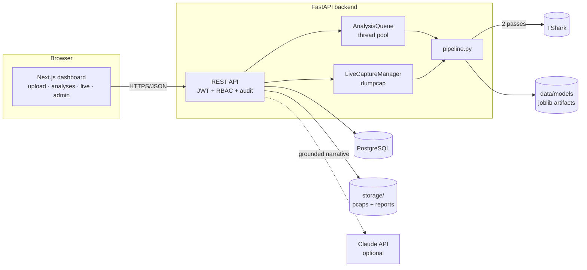
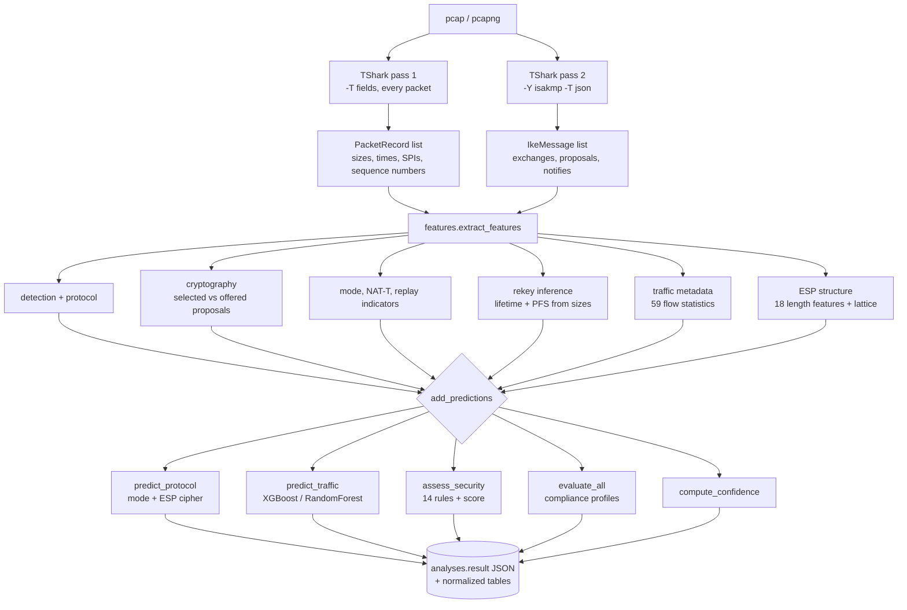
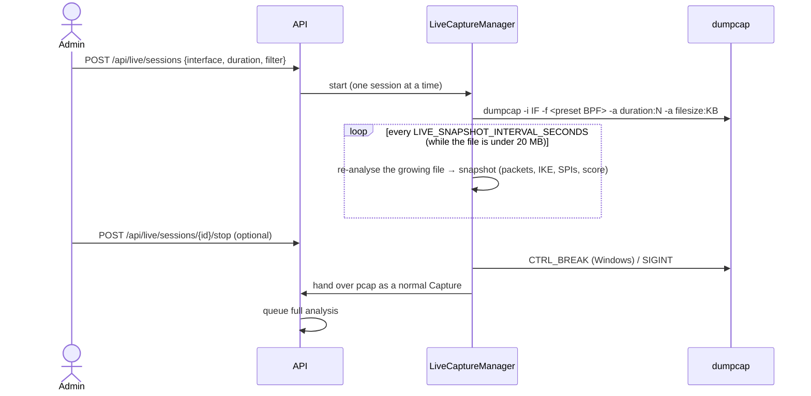

# Architecture

The analyzer turns a packet capture into a structured, evidence-labelled description of an IPsec deployment, a security assessment, compliance results and AI predictions. It never decrypts anything.

## Components



| Component | Code | Responsibility |
|---|---|---|
| Frontend | `frontend/app`, `frontend/components` | Login, dashboard, upload, analysis tabs (Protocol details, Security assessment, Compliance, Threat matrix, Traffic analysis, Reports), live capture, users and audit |
| API | `backend/app/api/` | Routers for auth, captures, analyses, reports, compliance, live capture, health |
| Worker | `backend/app/worker.py` | Runs analyses off the request thread (`ANALYSIS_WORKERS`, default 2). `ANALYSIS_EXECUTION=inline` runs synchronously for tests |
| Packet layer | `backend/app/packet/` | TShark wrapper, field map, IANA tables, IKE/ESP/rekey/traffic/ESP-structure analysis |
| Security | `backend/app/security/` | 14 rules and the Project Security Assessment Score |
| Compliance | `backend/app/compliance/` | JSON control profiles and their evaluation engine |
| ML | `backend/app/ml/` | Traffic classifier, protocol inference (mode, ESP cipher), ISCX importer, training |
| Confidence | `backend/app/confidence.py` | AI Confidence Score over the whole result |
| Reports | `backend/app/reports/` | Facts, deterministic or LLM narrative, executive and technical PDFs |
| Persistence | `backend/app/db/`, `backend/migrations/` | SQLAlchemy 2 models, repositories, Alembic migrations run at startup |

## Analysis pipeline



`pipeline.run_pipeline(path)` is `add_predictions(analyze_pcap(path))`:

1. **`analyze_pcap`** (deterministic). It runs both TShark passes and builds the `features` document, where every value is an `Observation` with `value`, `source` and `evidence` (see [methodology.md](methodology.md#source-labels)).
2. **`add_predictions`** layers the probabilistic and derived results on top, in this order: protocol inference, then the traffic prediction, then security (which may use high-confidence predictions, marked `predicted`), then compliance, then the confidence score.

The parser output is the only source of protocol values. ML never overwrites an observed value. It appears beside the observed value, labelled `predicted`.

## Request lifecycle

```mermaid
sequenceDiagram
    actor U as Analyst
    participant F as Frontend
    participant A as API
    participant W as Worker
    participant D as PostgreSQL
    U->>F: drop capture.pcap
    F->>A: POST /api/captures/upload (multipart)
    A->>A: extension + magic-byte check, size limit, SHA-256 name
    A->>D: Capture + Analysis(status=queued), audit "upload"
    A-->>F: 202 {analysis_id}
    A->>W: submit(analysis_id)
    W->>D: status=running
    W->>W: run_pipeline(path)
    W->>D: result JSON, configuration, findings, prediction; status=completed
    loop until completed or failed
        F->>A: GET /api/analyses/{id}/status
    end
    F->>A: GET /api/analyses/{id}
    A-->>F: full result (confidence score added if the stored result predates it)
```

## Live capture



Only preset filters (`ipsec`, `all`) exist, so no user text reaches the capture filter. The process is started with an argument list, never a shell.

## Data model

```mermaid
erDiagram
    users ||--o{ captures : owns
    captures ||--o{ analyses : has
    analyses ||--o| ipsec_configurations : summarizes
    analyses ||--o{ security_findings : produces
    analyses ||--o{ traffic_predictions : produces
    analyses ||--o{ reports : produces
    users ||--o{ audit_logs : performs
    users { uuid id; string email; enum role; string password_hash; bool is_active }
    captures { uuid id; string original_filename; string sha256; int size_bytes; string stored_path }
    analyses { uuid id; enum status; bool ipsec_detected; int security_score; string risk_level; json result }
    ipsec_configurations { string ike_version; string mode; string encryption_algorithm; string dh_group; string pfs; json observations }
    security_findings { string rule_id; string severity; text evidence; string source }
    traffic_predictions { string model_version; string predicted_label; float confidence; json probabilities }
    reports { enum kind; string sha256; string narrative_source }
    audit_logs { string action; string outcome; string ip_address; json detail }
```

`analyses.result` holds the complete JSON document the UI renders. The normalized tables (`ipsec_configurations`, `security_findings`, `traffic_predictions`) are there for querying across analyses, which the dashboard and audit views do. `GET /api/analyses/{id}/compliance` and report generation re-evaluate compliance from the stored `result`, so new or edited profiles apply to old analyses without re-parsing the capture.

## Design decisions

| Decision | Why |
|---|---|
| Two TShark passes instead of one JSON pass | JSON for every ESP packet is 50–100× larger. Pass 1 stays compact and pass 2 covers only IKE |
| `--no-duplicate-keys` on the JSON pass | TShark repeats keys for repeated fields, and JSON parsers keep only the last one, which silently loses proposals |
| Field map validated against `tshark -G fields` | Field names differ between Wireshark versions; `/health` reports any that are missing instead of the parser returning silent blanks |
| Group-level splits and cross-validation | Windows from one recording look alike, so a random split inflates accuracy (93.1% vs about 79–81% on ISCX); even group splits vary by several points with few recordings per class, so cross-validation is repeated over 5 splits and reported as mean ± spread |
| Bayesian cipher inference instead of a classifier | A classifier cannot recognise a cipher it never saw; the length lattice follows from RFC 4303 framing and needs no training |
| LLM only writes prose from a fact sheet, and a grounding check rejects any value not in the facts | Reports must never contain an invented algorithm or number |
| In-process worker behind an `AnalysisQueue` interface | Simple to deploy for the hackathon; the interface is where Celery/RQ would plug in |
